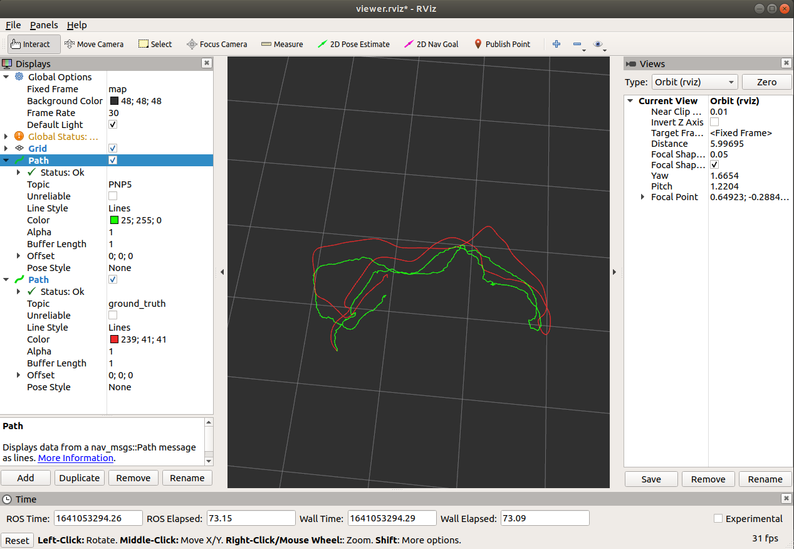
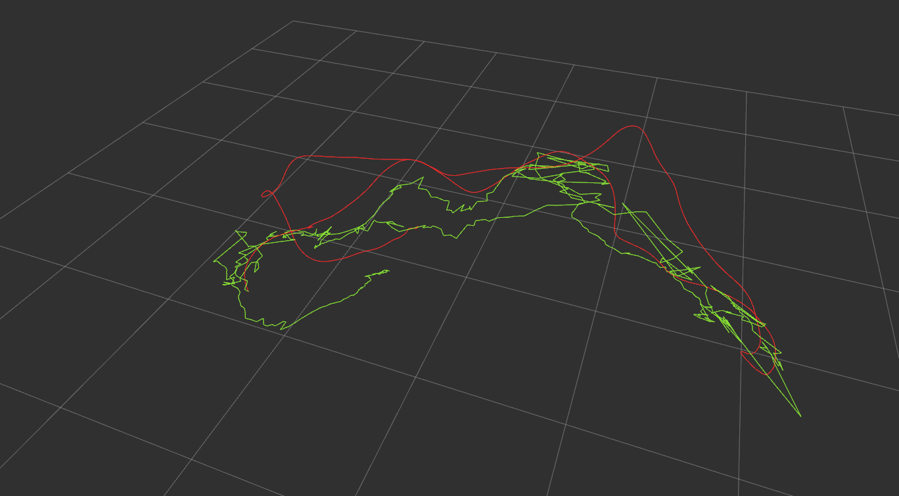
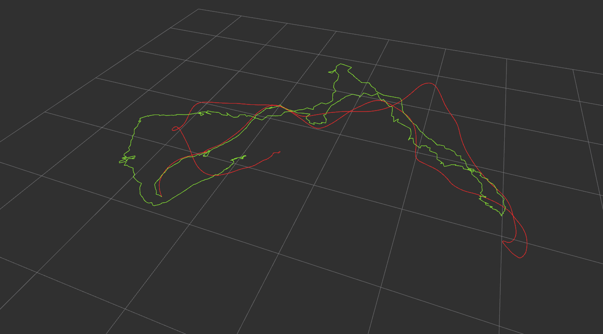
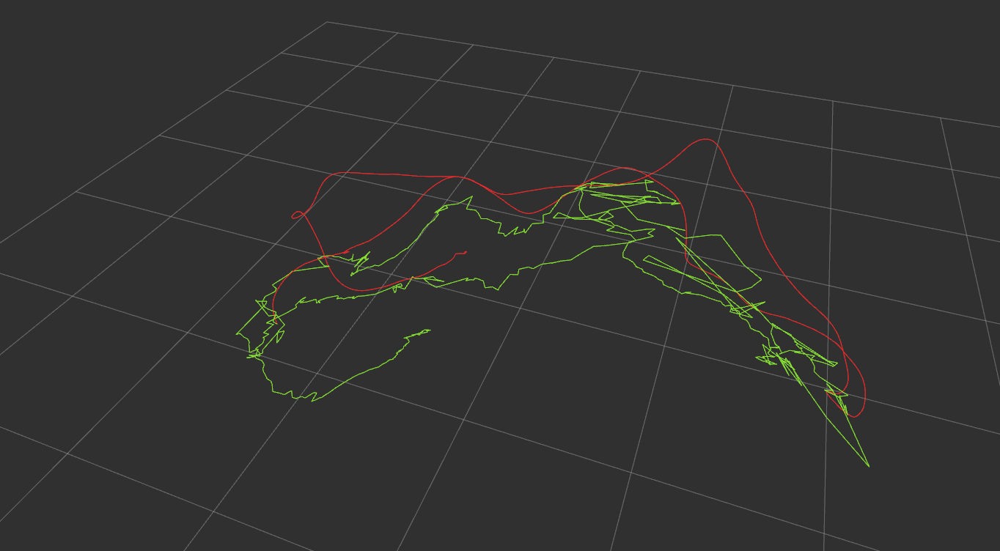
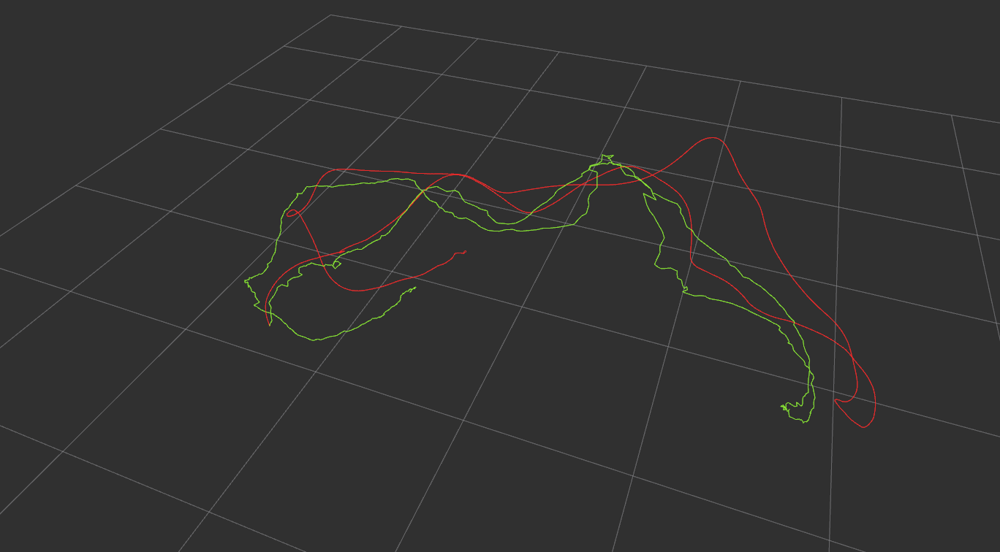
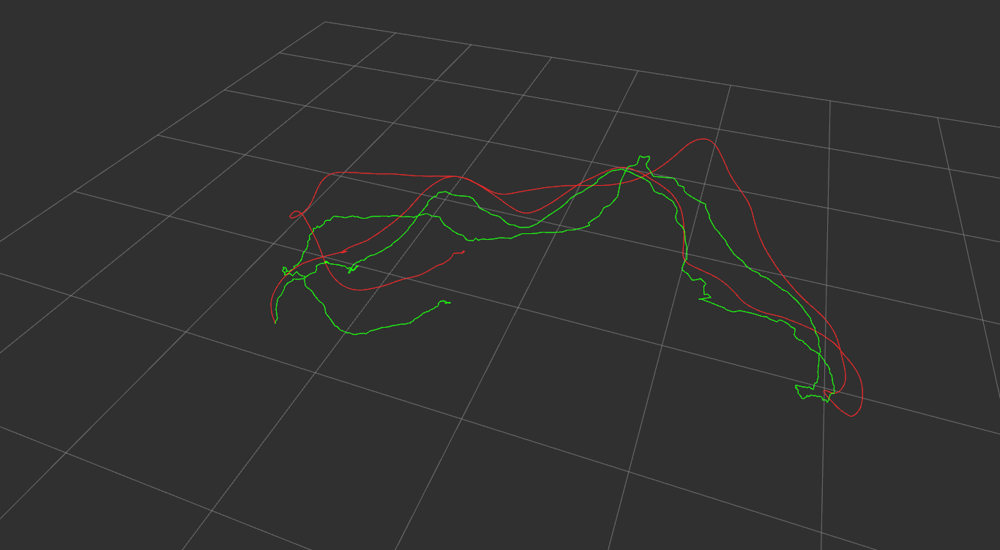
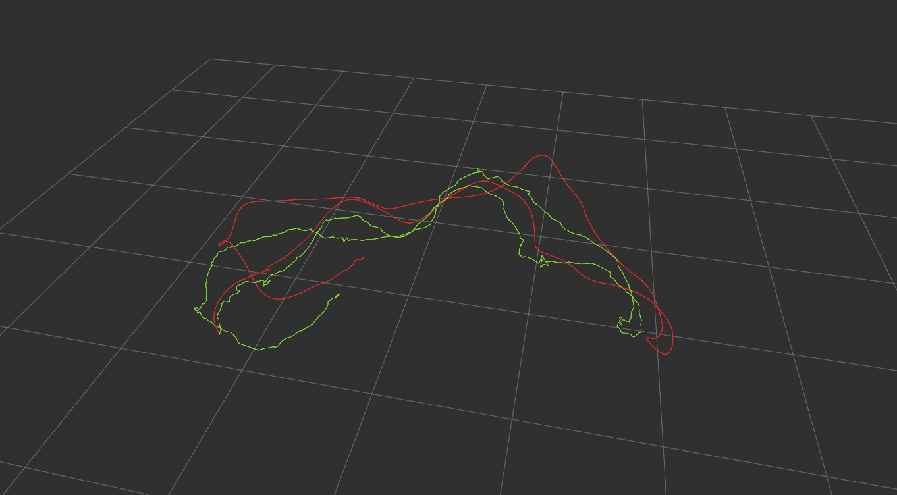

# Trytry Visual Odometry

A project about Visual Odometry, which uses ICP, PNP and BA to solve the rotation matrix R and vector T.

## Build && Run

Operation System: Ubuntu 18.04

ROS: Melodic

### Required

#### g2o

```bash
git clone https://github.com/RainerKuemmerle/g2o.git
mkdir build
cd build
cmake ..
make
sudo make install
```

#### Sophus

```
git clone https://github.com/strasdat/Sophus.git
mkdir build
cd build
cmake ..
make
sudo make install
```

#### Glog

[Building from Source](https://github.com/google/glog#cmake)

#### Eigen3

```bash
sudo apt-get install libeigen3-dev
```

#### Opencv

Get the latest version here [Github](https://github.com/opencv/opencv).

The project used Opencv that comes with ROS.

### Build

This is a ROS packages.

```bash
mkdir -p ~/catkin_ws/src
cd ~/catkin_ws/src
git clone https://github.com/heiheishuang/trytry_vo.git
cd ..
catkin_make
source devel/setup.bash # Change to `source devel/setup.zsh` if you use zsh.
```

### Run

```zsh
roslaunch trytry_vo viewer.launch
```



## Parameters

### Dataset

**data_set**: The folder where the dataset is stored

**ground_truth_path**:

### Camera

camera calibration and distortion parameters

### Frontend

**estimate_pose**:  Estimation pose using BA PnP SVD or RANSAC

**ransac_max_iterators**: Set maximum number of iterations

**number_optimize_frame**: Using g2o to optimize frame poses. Set number of frames

### System

Initial pose required for pose initialization

**write_file**: T: If you want to write odometer data in a file; F: If you don't want to write a file

**file_name**: The name of file to write

## Result (Green: ours; Red: ground_truth)

### Using SVD



### Using SVD and Ransac



### Using BA (frame-to-frame PnP)



### Using PnP and Ransac



### Using PnP and Optimize 5 frames



### Using PnP and Optimize 30 frames



## Tranks

https://github.com/LittleDang/mySlam

https://github.com/gaoxiang12/slambook2